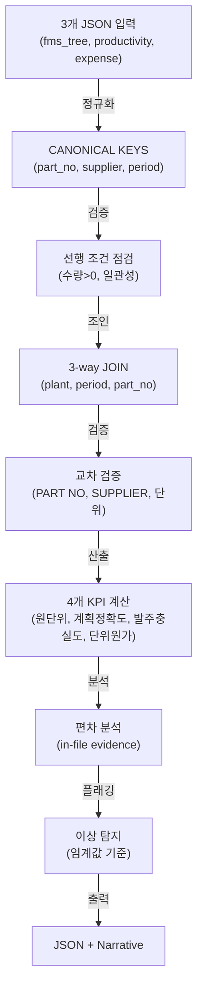

# FMS Cross-System KPI 빠른 참조 (4개 지표)

> **목적**: 생산성·경비·BOM 3시스템 데이터로부터 4개 KPI를 산출
> **기준**: (plant="Mannur", period="YYYY-MM", part_no)
> **작성**: 2026-06-13

---

## 4개 KPI 정의 & 공식

### 1️⃣ 원단위 (Unit Consumption / 生産量当たりの材料所要量)

**정의**: 생산량 1단위당 소요되는 자재 비율

```
원단위 = (BOM REQ_QTY) ÷ (생산성 생산량)

단위: pcs/1생산, kg/1생산, 등
```

**예시**:
```
BOM REQ_QTY(부품X) = 1,200 pcs (월간)
생산성 ACTUAL_QTY = 100대 (월간)
→ 원단위 = 12 pcs/1대
```

**해석**:
- ↑ 증가: 생산 효율성 저하 (waste, scrap 증가)
- ↓ 감소: 효율성 개선
- 정상: 전월 대비 ±5% 이내 | 경고: >10% 편차 시 품질 조사 필요

---

### 2️⃣ 계획정확도 (Planning Accuracy)

**정의**: 계획 구매액 vs 실제 구매액 일치율

```
계획정확도 = ABS((계획액 - 실제액) / 계획액) × 100%

계획액 = Σ (BOM REQ_QTY × 단가)
실제액 = Σ (Expense actual_cost)
```

**정확도 등급**:
```
≤ 5%     = 🟢 GREEN (정상)
5~10%   = 🟡 YELLOW (주의, 공급사 협상 추천)
> 10%   = 🔴 RED (편차 원인 조사)
```

**편차 원인**:
- 단위원가 변동 (공급사 가격 인상/인하)
- REQ_QTY 증감 (PLAN_QTY ↑↓ 또는 OPT% ↑↓)
- 공급사 변경
- scrap/반납 (손실)

---

### 3️⃣ 발주충실도 (Procurement Fulfillment Rate)

**정의**: 계획 발주량 대비 실제 입고량 달성율

```
발주충실도 = (실제 입고량) ÷ (BOM REQ_QTY) × 100%
```

**정상 범위**:
```
95~105%  = 정상 (일부 재발주/반납 포함)
< 95%    = 미달 (공급 부족, 딜리버리 지연)
> 105%   = 과잉 (안전재고, MOQ 초과)
```

**편차 원인**:
- 공급사 딜리버리 지연
- 부분 수령 (QC 탈락, 반품)
- BOM 계획 변경 후 미취소
- 안전재고 추가

---

### 4️⃣ 단위원가 (Unit Cost / 原価)

**정의**: 제품 1단위당 자재 소요 원가

```
단위원가 = (Expense 총 비용) ÷ (생산성 생산량)

단위: Rs/1생산, Rs/1시간, 등
```

**예시**:
```
Expense PART X 실제 비용 = Rs 120,000 (월간)
생산성 ACTUAL_QTY = 100대 (월간)
→ 단위원가 = Rs 1,200 / 1대
```

**원가 구성**:
```
= 자재비 + 인건비(R&M) + 유틸리티(전력) + 기타
```

**Variance**:
```
단위원가 편차 = (실제 원가) - (목표 원가)
(+) 초과원가: 효율성 저하
(-) 절감: 공급사 할인, 효율 개선
정상: ±5% 이내
```

---

## 입력 데이터 (3개 JSON)

### 1. fms_tree (BOM 시스템)
```json
{
  "period": "2026-06",
  "products": [
    {
      "product": "QXI FSB",
      "customerPlan": 65386,
      "childParts": [
        {
          "partNo": "88310-K3050",
          "reqQty": 1200,
          "supplier": "SRI BALAJI",
          "us": 1,
          "optPct": 0.3681
        }
      ]
    }
  ],
  "ppcPlan": [
    {
      "partNo": "88310-K3050",
      "planQty": 65386,
      "optPct": 0.3681
    }
  ]
}
```

### 2. 생산성 JSON (Productivity)
```json
{
  "period": "2026-06",
  "products": [
    {
      "partNo": "88310-K3050",
      "planQty": 65386,
      "actualQty": 100,
      "unitCostSales": 1234.56
    }
  ]
}
```

### 3. 경비 JSON (Expense)
```json
{
  "period": "2026-06",
  "ledgers": [
    {
      "code": "3.1",
      "transactions": [
        {
          "partNo": "88310-K3050",
          "supplier": "SRI BALAJI",
          "qty": 1200,
          "price": 100,
          "amount": 120000
        }
      ]
    }
  ]
}
```

### 4. previous_month_json (전월 데이터, 변동율 계산용)
```json
{
  "period": "2026-05",
  "kpi": {
    "unitMaterial": { "curr": 1.221 },
    "planAccuracy": { "curr": 0.92 },
    "supplyFulfillment": { "curr": 0.96 },
    "unitCost": { "curr": 1210.45 }
  }
}
```

---

## 출력 JSON 스키마

```json
{
  "metadata": {
    "period": "2026-06",
    "plant": "Mannur",
    "generated_at": "2026-06-13T22:30:00Z",
    "dataSource": ["fms_tree", "productivity_json", "expense_json"]
  },
  "summary": {
    "totalPartNos": 145,
    "matchedPartNos": 142,
    "unmatchedParts": {
      "bomOnly": 3,
      "expenseOnly": 0,
      "productivityOnly": 2
    }
  },
  "kpi": {
    "unitMaterial": {
      "curr": 1.234,
      "prev": 1.221,
      "delta": 0.013,
      "trend": "↑",
      "assessment": "within tolerance (1.3%)",
      "by_part_no": [
        {
          "partNo": "88310-K3050",
          "car": "QXI",
          "supplier": "SRI BALAJI",
          "curr": 12.0,
          "prev": 11.8,
          "delta_pct": 1.7,
          "status": "ok"
        }
      ]
    },
    "planAccuracy": {
      "curr": 0.996,
      "prev": 0.920,
      "delta": 0.076,
      "trend": "↑",
      "portfolio_accuracy_pct": 99.6,
      "status": "ok",
      "by_supplier": [
        {
          "supplier": "SRI BALAJI",
          "partCount": 45,
          "plannedCost": 2500000,
          "actualCost": 2480000,
          "variance_pct": 0.8,
          "status": "ok"
        },
        {
          "supplier": "MIP",
          "partCount": 28,
          "plannedCost": 890000,
          "actualCost": 975000,
          "variance_pct": 9.6,
          "status": "yellow",
          "reason": "공급사 가격 인상"
        }
      ]
    },
    "supplyFulfillment": {
      "curr": 0.982,
      "prev": 0.960,
      "delta": 0.022,
      "trend": "↑",
      "avg_fulfillment_pct": 98.2,
      "critical_shortage_items": 1,
      "by_part_no": [
        {
          "partNo": "44120-A1234",
          "supplier": "YATHRA",
          "reqQty": 500,
          "actualReceiptQty": 450,
          "fulfillment_rate_pct": 90.0,
          "status": "critical",
          "pending_qty": 50,
          "expectedDelivery": "2026-06-15"
        }
      ]
    },
    "unitCost": {
      "curr": 1234.56,
      "prev": 1210.45,
      "delta": 24.11,
      "trend": "↑",
      "by_car_model": [
        {
          "car": "QXI",
          "model": "QXIFL",
          "total_unit_cost_rs": 28500,
          "variance_pct": 2.1,
          "status": "ok"
        }
      ]
    }
  },
  "anomalies": [
    {
      "type": "unitMaterial",
      "part_no": "88310-A5000",
      "supplier": "SUPPLIER X",
      "severity": "critical",
      "threshold": 10,
      "actual_value": 22.5,
      "issue": "원단위 변동률 22.5% (임계값 10%) — QC 탈락 재작업 반영",
      "recommendation": "공급사 품질 회의 필요"
    },
    {
      "type": "planAccuracy",
      "supplier": "MIP",
      "severity": "warn",
      "actual_value": 9.6,
      "issue": "계획 편차 9.6% (임계값 10%) — 공급사 인상 반영",
      "recommendation": "MIP 공급사 협상 추천"
    },
    {
      "type": "supplyFulfillment",
      "part_no": "44120-A1234",
      "supplier": "YATHRA",
      "severity": "critical",
      "actual_value": 90.0,
      "issue": "발주충실도 90% (미달) — 50 pcs 미수령",
      "expectedDelivery": "2026-06-15"
    }
  ],
  "actions": [
    {
      "priority": "P0",
      "type": "supply_chain",
      "action": "YATHRA 공급사 follow-up: 44120-A1234 50 pcs, 예정납기 2026-06-15",
      "owner": "Supply Chain",
      "dueDate": "2026-06-15"
    },
    {
      "priority": "P1",
      "type": "procurement",
      "action": "MIP 공급사 협상: 9.6% 가격 인상 대응",
      "owner": "Procurement",
      "dueDate": "2026-06-20"
    },
    {
      "priority": "P1",
      "type": "quality",
      "action": "88310-A5000 원단위 22.5% 초과 → QC 재검사 및 공급사 회의",
      "owner": "QA",
      "dueDate": "2026-06-17"
    }
  ],
  "narrative_ko": "6월 3시스템 교차 KPI 분석 완료. 총 145개 품번 중 142개 매칭(미매칭 3개 BOM전용). 원단위 1.234 (전월 1.221, +1.3% 정상), 계획정확도 99.6% (우수), 발주충실도 98.2% (정상). 이상 3건: (1) 88310-A5000 원단위 22.5% 초과(QC탈락), (2) MIP 계획편차 9.6%(가격인상), (3) 44120-A1234 발주 90%(50pcs 미수령, 예정 06-15). 권장사항: YATHRA follow-up, MIP 협상, 88310-A5000 QC 재검사."
}
```

---

## 처리 순서 (Operational Protocol)



---

## 임계값 설정

```json
{
  "unitMaterial": {
    "warn_pct": 10,
    "critical_pct": 20
  },
  "planAccuracy": {
    "green": "≤5%",
    "yellow": "5~10%",
    "red": ">10%"
  },
  "supplyFulfillment": {
    "min_pct": 95,
    "max_pct": 105
  },
  "unitCost": {
    "tolerance_pct": 5
  }
}
```

---

## 주의사항

1. **조인 결손**: BOM only / Expense only / Productivity only → orphan_part_nos[] 기록
2. **기간**: 단일 {YYYY-MM} 범위만 처리. 혼합 월 → error
3. **정규화**: part_no(UPPERCASE), supplier(UPPERCASE+trim), period("YYYY-MM" 고정)
4. **편차 분석**: 반드시 in-file evidence 사용 (fabrication 금지)
5. **소수점**: 원단위·충실도(1자리), 정확도(1~2자리), 원가(정수)

---

## 변경 이력

- **2026-06-13 22:45 KST** — Cross-KPI 빠른 참조 문서 작성. 4개 KPI 공식·입출력·처리순서 요약.
